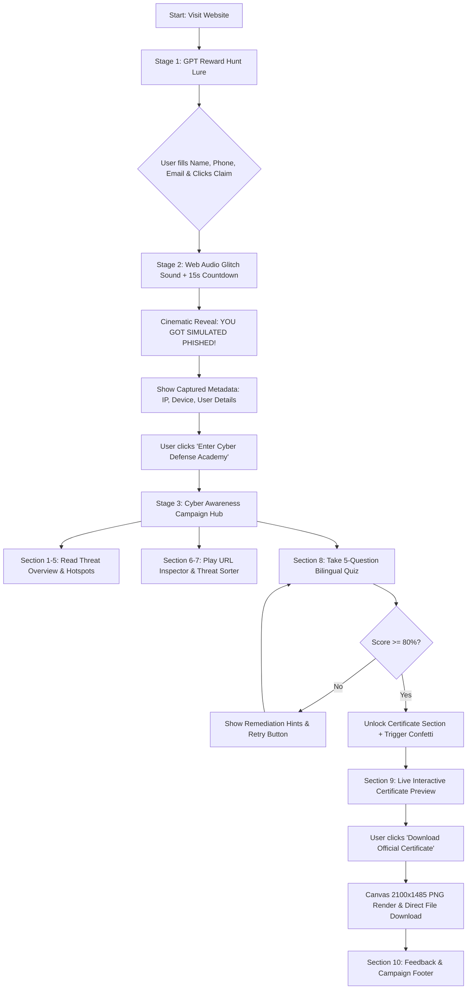

# Comprehensive Project Documentation
## Cyber Security Awareness Campaign & Simulated Phishing Platform
### *GPT Reward Hunt Simulation & Cyber Defense Academy*

**Organized & Developed By:**  
**Department of Computer Science Engineering (CSE)**  
**Technical Club • Government Polytechnic Bantwal**

---

## Table of Contents
1. [Project Overview](#1-project-overview)
2. [Project Objective](#2-project-objective)
3. [Problem Statement](#3-problem-statement)
4. [Solution Overview](#4-solution-overview)
5. [Complete User Journey](#5-complete-user-journey)
6. [Features (Current & Planned)](#6-features-current--planned)
7. [Complete Folder Structure](#7-complete-folder-structure)
8. [Complete Tech Stack](#8-complete-tech-stack)
9. [System Architecture](#9-system-architecture)
10. [Website Flow Diagram](#10-website-flow-diagram)
11. [Page-by-Page Explanation](#11-page-by-page-explanation)
12. [Component Structure](#12-component-structure)
13. [Assets & Resources](#13-assets--resources)
14. [Data Flow](#14-data-flow)
15. [State Management](#15-state-management)
16. [Performance Optimizations](#16-performance-optimizations)
17. [Accessibility Features](#17-accessibility-features)
18. [SEO Strategy](#18-seo-strategy)
19. [Responsive Design Strategy](#19-responsive-design-strategy)
20. [Browser Compatibility](#20-browser-compatibility)
21. [Security Considerations](#21-security-considerations)
22. [Deployment Process](#22-deployment-process)
23. [Environment Variables](#23-environment-variables)
24. [Future Improvements](#24-future-improvements)
25. [Project Timeline / Development Phases](#25-project-timeline--development-phases)
26. [Credits & Authors](#26-credits--authors)
27. [License](#27-license)
28. [Conclusion](#28-conclusion)

---

## 1. Project Overview

The **Cyber Security Awareness Campaign** is an interactive, web-based educational platform and simulated phishing experience designed by the **Technical Club, Department of Computer Science Engineering (CSE), Government Polytechnic Bantwal**.

The platform tackles one of today's most critical digital safety challenges: **Social Engineering & Phishing Scams**. By combining a realistic, controlled "simulated trap" (*The GPT Reward Hunt*) with a 15-second cinematic reveal and a comprehensive Cyber Defense Academy, the platform transforms passive safety warnings into an unforgettable, high-impact experiential learning module.

Key highlights include:
- **Simulated Phishing Lure (GPT Reward Hunt)**: Demonstrates how easily credentials and personal information can be harvested by deceptive promotional offers.
- **15-Second Cinematic Reveal**: A dramatic matrix-glitch countdown showing simulated harvested telemetry (Device Info, Browser Details, IP address simulation) to trigger instant user awareness.
- **Cyber Defense Academy**: Interactive hotspot inspection, URL security verification, threat sorting games, real-life scenario simulators, and a bilingual knowledge quiz.
- **2100 × 1485 High-DPI Certificate Generator**: Custom HTML5 Canvas engine producing official, printable Certificates of Participation with verification IDs, issue dates, and confetti celebrations.
- **Full Bilingual Support**: Native toggle between **English** and **Kannada (ಕನ್ನಡ)** across all modules, quizzes, and interface controls.

---

## 2. Project Objective

1. **Demonstrate Real-World Vulnerability**: Help students, staff, and citizens recognize how attackers leverage curiosity, urgency, and greed (e.g., "Free GPT 4.0 Subscriptions", "Instant Cash Rewards") to manipulate victims.
2. **Train Threat Recognition Skills**: Teach users how to spot red flags in suspicious emails, fake URLs, deceptive SMS messages, and malicious downloads.
3. **Provide Hands-On Interactive Games**: Replace dull text manuals with interactive hotspot inspectors, domain safety checkers, and scenario-based decision making.
4. **Evaluate Security Literacy**: Test user comprehension through an automated 5-question bilingual quiz.
5. **Issue Verifiable Certificates**: Reward participants who complete the security assessment with a high-resolution, digitally verifiable certificate issued by Technical Club, Government Polytechnic Bantwal.
6. **Promote Language Inclusivity**: Ensure accessibility for regional learners in Karnataka by providing full Kannada language translation across all learning modules.

---

## 3. Problem Statement

With the rapid expansion of digital banking, e-commerce, and AI tools, social engineering attacks have risen exponentially. Common challenges include:
- **High Victim Susceptibility**: Users routinely fall for fraudulent links offering free prize money, urgent account suspensions, or premium software giveaways.
- **Ineffective Passive Education**: Traditional lectures, flyers, and static PDFs fail to engage users or create lasting behavioral change.
- **Domain & Link Confusion**: Users struggle to distinguish official domains (e.g., `https://banking.example.com`) from lookalike phishing domains (e.g., `http://banking-login-reward.xyz`).
- **Language Barriers**: Security awareness material in India is frequently available only in English, leaving non-English proficient users vulnerable to scam calls, messages, and links.

---

## 4. Solution Overview

The platform uses a 3-stage **Hook, Shock, & Educate** methodology:

| Stage | Name | Mechanism & Experience |
| :--- | :--- | :--- |
| **Stage 1** | **The Hook (GPT Reward Hunt)** | Presents a flashy, enticing offer promising free GPT-4 access and cash rewards. Asks for user details (Name, Phone, Email) to unlock the prize. |
| **Stage 2** | **The Shock (Cinematic Reveal)** | Upon form submission, triggers audio glitch effects, dark alert themes, and a 15-second matrix countdown revealing: *"YOU JUST GOT SIMULATED PHISHED!"* Displays captured metadata to illustrate what real attackers harvest. |
| **Stage 3** | **The Education (Cyber Defense Academy)** | Unlocks the full interactive campaign hub containing threat overviews, email red-flag hotspots, URL security checkers, interactive scenarios, a bilingual quiz, and an automated certificate generator. |

---

## 5. Complete User Journey

```
[1. GPT Reward Hunt Landing Page]
               │
               ▼
[2. User Submits Name, Phone, Email]
               │
               ▼
[3. Web Audio Glitch & 15s Cinematic Reveal]
               │
               ▼
[4. "You Got Simulated Phished!" Breakdown]
               │
               ▼
[5. Transition to Cyber Awareness Hub]
               │
               ▼
┌──────────────────────────────────────────────┐
│  Interactive Cyber Defense Academy Modules   │
├──────────────────────────────────────────────┤
│  • Section 1: Phishing & Social Engineering │
│  • Section 2: Password Security & 2FA        │
│  • Section 3: Spot Warning Signs (Hotspots)  │
│  • Section 4: Malware & Mobile Safety        │
│  • Section 5: Safe Online Shopping           │
│  • Section 6: Real-Life Scenario Simulator   │
│  • Section 7: URL Inspector & Threat Sorter  │
└──────────────────────────────────────────────┘
               │
               ▼
[6. Section 8: Bilingual Knowledge Quiz]
               │
               ▼
[7. Pass Quiz (80%+ Score)] ──► Confetti Blast 🎉
               │
               ▼
[8. Section 9: 2100×1485 High-Res Certificate Generator]
               │
               ▼
[9. Download PNG Certificate / Submit Feedback]
```

---

## 6. Features (Current & Planned)

### Current Features
- **Simulated Phishing Landing Page**: Photorealistic "GPT Reward Hunt" lure featuring promotional cards, urgency counters, and input fields.
- **Cinematic Matrix Reveal**: Web Audio synth sound effects, custom countdown clock, and live telemetry preview.
- **Custom Web Audio Sound Engine**: Built-in synth (`/src/utils/sound.ts`) generating click tones, cyber glitch sounds, alarm beeps, and victory fanfares without external audio file dependencies.
- **Interactive Red-Flag Hotspot Inspector**: Clickable email and SMS interfaces highlighting fraudulent sender addresses, artificial urgency, bad grammar, and suspicious links.
- **URL Security Inspector**: Interactive game evaluating legitimate vs. phishing URLs with explanations.
- **Threat Bucket Sorter**: Drag/click classification tool categorizing digital behaviors into "Safe Practice" vs. "Phishing Trap".
- **Real-Life Scenario Simulator**: Decision-tree choices reflecting daily digital situations (e.g., suspicious bank calls, unknown WhatsApp APK links) with instant feedback.
- **Bilingual Engine (English & Kannada)**: One-click language switcher (`en` / `kn`) toggling all headings, paragraphs, quiz questions, choices, and hints.
- **Automated Knowledge Assessment Quiz**: 5 randomized/structured security questions with score tracking and instant remediation feedback.
- **2100 × 1485 High-Res Certificate Generator**:
  - Exact 2100x1485 pixel dimension canvas rendering.
  - Institutional headers: **Government Polytechnic Bantwal**, **Technical Club**, **Department of Computer Science Engineering (CSE)**.
  - Multi-line decorative gold borders and corner filigree ornaments.
  - Faint background security watermark shield.
  - Digitally Verified status badge, Issue Date, and unique Certificate ID (`GPB-CSE-XXXXXX`).
  - One-click PNG download.
- **Interactive Cyber Background Canvas**: Dual custom HTML5 Canvas particle systems (`CyberBackgroundAnimation`, `LandingBackgroundCanvas`, `AwarenessBackgroundCanvas`) featuring grid scanlines and reactive node webs.
- **Sticky Header & Audio Controls**: Scroll progress indicator, mute/unmute toggle, and jump-to-certificate shortcuts.

### Planned Features
- **Admin Analytics Dashboard**: Track total simulation completions, common quiz mistakes, and user pass rates.
- **Dynamic AI Phishing Generator**: Integrated `@google/genai` endpoint generating custom phishing scenarios based on current tech news.
- **SMS / WhatsApp Simulation Mode**: Simulated smartphone screen with live interactive scam chat flows.
- **Multi-Institution Branding**: Configurable institutional logos and department titles for deployment in other polytechnic colleges.

---

## 7. Complete Folder Structure

```
Cyber-Awareness-Campaign/
├── .env.example                     # Environment variables template
├── .gitignore                        # Git exclusion rules
├── package.json                      # Project manifest & dependency declarations
├── vite.config.ts                    # Vite build configuration
├── tsconfig.json                     # TypeScript compiler configuration
├── index.html                        # Main HTML entry point
├── metadata.json                     # Platform applet metadata & permissions
├── public/                           # Static assets served at root
│   └── assets/
│       └── images/                   # Institutional logo placeholders
└── src/
    ├── main.tsx                      # React root rendering entry point
    ├── App.tsx                       # Master container & global state orchestrator
    ├── index.css                     # Global Tailwind CSS imports & print styles
    ├── types.ts                      # Global TypeScript type interfaces
    ├── components/                   # React UI components
    │   ├── Header.tsx                # Sticky top bar, language toggle, audio control
    │   ├── LandingPage.tsx           # GPT Reward Hunt lure landing page
    │   ├── CinematicReveal.tsx       # 15s countdown & simulated telemetry reveal
    │   ├── AwarenessHero.tsx         # Main campaign hero banner & quick stats
    │   ├── SectionsOverview.tsx      # Educational threat cards (Phishing, Passwords, etc.)
    │   ├── SectionHotspots.tsx       # Interactive email/SMS red-flag inspector
    │   ├── InteractiveChallenges.tsx # URL Inspector, Threat Sorter, Scenario Simulator
    │   ├── SectionQuiz.tsx           # Bilingual knowledge assessment quiz
    │   ├── SectionCertificate.tsx    # 2100x1485 Canvas certificate generator & preview
    │   ├── FooterAndFeedback.tsx     # Campaign footer & user feedback form
    │   ├── CyberBackgroundAnimation.tsx # Global background particle & scanline canvas
    │   ├── LandingBackgroundCanvas.tsx # High-intensity lure page background canvas
    │   └── AwarenessBackgroundCanvas.tsx # Ambient cyber node particle canvas
    ├── data/
    │   └── translations.ts           # Complete English & Kannada translation dictionary
    └── utils/
        └── sound.ts                  # Web Audio API sound synthesizer
```

### Folder & File Descriptions

| Path | Purpose |
| :--- | :--- |
| `package.json` | Contains npm dependencies (`react`, `motion`, `lucide-react`, `canvas-confetti`, `express`, `@google/genai`, `tailwindcss`, `vite`). |
| `vite.config.ts` | Configures Vite bundler, React plugin, and dev server bindings. |
| `index.html` | Defines root DOM node `<div id="root"></div>`, meta viewports, and Google Fonts imports (Georgia, Plus Jakarta Sans, JetBrains Mono). |
| `metadata.json` | Platform metadata defining app name, description, frame permissions, and major capabilities. |
| `src/main.tsx` | Standard React 19 entry point mounting `<App />` into the DOM. |
| `src/App.tsx` | Main application state holder (`appStage`, `lang`, `userData`, `quizPassed`, `scrollProgress`, `isMuted`). |
| `src/types.ts` | Declares interfaces for `UserData`, `QuizQuestion`, `Hotspot`, `UrlCheckItem`, `Scenario`, `SortItem`. |
| `src/index.css` | Imports `@import "tailwindcss";` and defines scrollbar styling, selection colors, and print media rules. |
| `src/data/translations.ts` | Comprehensive translation matrix containing all text in English (`en`) and Kannada (`kn`). |
| `src/utils/sound.ts` | Web Audio API synthesizer constructing synthesized sound effects without relying on audio files. |
| `src/components/Header.tsx` | Top bar displaying institutional title, reading progress bar, language toggle, mute control, and jump button. |
| `src/components/LandingPage.tsx` | Photorealistic phishing trap asking for participant credentials to unlock GPT-4 rewards. |
| `src/components/CinematicReveal.tsx` | 15-second matrix-style countdown displaying "SIMULATED PHISHED!" along with captured device metadata. |
| `src/components/AwarenessHero.tsx` | Introduction banner for the Cyber Defense Academy featuring campaign motto and quick action buttons. |
| `src/components/SectionsOverview.tsx` | 4 core educational cards: Phishing 101, Passwords & 2FA, Malware Defense, and Safe Shopping. |
| `src/components/SectionHotspots.tsx` | Interactive email and SMS mockup where users tap hidden hotspots to uncover phishing red flags. |
| `src/components/InteractiveChallenges.tsx` | Houses three interactive games: URL Security Inspector, Threat Bucket Sorter, and Real Scenarios. |
| `src/components/SectionQuiz.tsx` | 5-question bilingual quiz with score feedback and certificate unlock handler. |
| `src/components/SectionCertificate.tsx` | Dual-view certificate engine: live responsive preview + 2100×1485 HTML5 Canvas exporter with confetti. |
| `src/components/FooterAndFeedback.tsx` | Footer containing disclaimers, credits, social sharing triggers, and feedback form. |
| `src/components/CyberBackgroundAnimation.tsx` | Orchestrates animated background particles and scanlines across stages. |

---

## 8. Complete Tech Stack

| Layer | Technology | Version / Specification | Description |
| :--- | :--- | :--- | :--- |
| **Frontend Framework** | React | `^19.0.1` | Component-based UI engine. |
| **Language** | TypeScript | `~5.8.2` | Strongly typed JavaScript development. |
| **Styling** | Tailwind CSS | `^4.1.14` | Utility-first CSS framework with `@tailwindcss/vite`. |
| **Animation** | Motion (Framer Motion) | `^12.23.24` | Smooth transitions, layout shifts, and reveal effects. |
| **Icons** | Lucide React | `^0.546.0` | Modern vector icon set (`Shield`, `Lock`, `AlertTriangle`, `CheckCircle2`, `Globe`, `Volume2`, `VolumeX`, etc.). |
| **Audio Engine** | Web Audio API | Native Browser API | Oscillator-based audio synth (`sound.ts`) for clicks, glitches, alarms, and fanfare. |
| **Graphic Export** | HTML5 Canvas 2D | Native Browser API | High-resolution 2100×1485 pixel certificate renderer in `SectionCertificate.tsx`. |
| **Visual FX** | Canvas Confetti | `^1.9.4` | Particle explosion animation upon passing the quiz and generating certificates. |
| **Build Tool** | Vite | `^6.2.3` | Lightning-fast module bundler & dev server. |
| **Server Capabilities** | Express / TSX | `^4.21.2` / `^4.21.0` | Optional backend server entry point for API proxies. |
| **AI SDK** | `@google/genai` | `^2.4.0` | Official Google Gen AI TypeScript SDK (prepared for backend dynamic scenario generation). |

---

## 9. System Architecture

```
                  ┌──────────────────────────────────────────────┐
                  │                 Browser Client               │
                  └──────────────────────┬───────────────────────┘
                                         │
                 ┌───────────────────────┴───────────────────────┐
                 │                React 19 Core                  │
                 │                                               │
                 │  ┌─────────────────────────────────────────┐  │
                 │  │       App.tsx (Global State Manager)    │  │
                 │  │   • appStage: 'landing'|'reveal'|'aware'│  │
                 │  │   • lang: 'en' | 'kn'                   │  │
                 │  │   • userData: { name, phone, email }   │  │
                 │  │   • quizPassed: boolean                 │  │
                 │  └────────────────────┬────────────────────┘  │
                 └───────────────────────┼───────────────────────┘
                                         │
    ┌────────────────────┬───────────────┴───────────────┬────────────────────┐
    │                    │                               │                    │
    ▼                    ▼                               ▼                    ▼
┌──────────────┐  ┌──────────────┐              ┌──────────────┐    ┌──────────────────┐
│ Web Audio    │  │ Bilingual    │              │ HTML5 Canvas │    │ Canvas Confetti  │
│ Synth Engine │  │ Dictionary   │              │ 2100×1485    │    │ Particle Engine  │
│ (sound.ts)   │  │(translations)│              │ Renderer     │    │ (canvas-confetti)│
└──────────────┘  └──────────────┘              └──────────────┘    └──────────────────┘
```

---

## 10. Website Flow Diagram



---

## 11. Page-by-Page Explanation

### Page 1: Stage 1 — GPT Reward Hunt (The Lure)
- **Visual Design**: High-energy, gradient-filled promotional landing page promising free access to "GPT-4.0 Pro" and ₹10,000 cash prizes.
- **Form Mechanics**: Requires Name, Phone Number, and Email Address.
- **Psychological Trigger**: Leverages urgency timers ("Offer expires in 04:59"), fake recent claim notifications, and trust badges.

### Page 2: Stage 2 — The Cinematic Reveal
- **Visual Design**: Dark matrix slate canvas with crimson alert accents, pulsing lock icons, and a bold 15-second countdown timer.
- **Telemetry Display**: Displays simulated IP (`192.168.1.104`), browser details (`Chrome / Windows`), resolution, and the exact contact details entered.
- **Educational Message**: Explains clearly: *"This was a harmless simulation conducted by Government Polytechnic Bantwal to teach you cyber vigilance."*

### Page 3: Stage 3 — Cyber Defense Academy
- **Hero Banner**: Displays institutional titles, campaign motto (*“Think Before You Click. Verify Before You Trust.”*), quick stats, and quick-scroll navigation.
- **Educational Sections**:
  1. *Phishing 101*: What is phishing, spear phishing, smishing, and vishing.
  2. *Password & 2FA Security*: Creating strong passphrases and enabling Multi-Factor Authentication.
  3. *Spot Warning Signs*: Interactive email and SMS mockups with inspectable red flags.
  4. *Malware & Mobile Safety*: Dangers of downloading unofficial APKs and third-party app stores.
  5. *Safe Online Shopping*: Checking HTTPS padlocks, domain age, and fake e-commerce deals.
  6. *Real-Life Scenario Simulator*: Interactive decision scenarios with instant feedback.
  7. *Interactive Games*: URL Inspector & Threat Bucket Sorter.
  8. *Bilingual Quiz*: 5 multiple-choice questions evaluating core concepts.
  9. *Certificate Generator*: 2100×1485 high-resolution canvas certificate generator.
  10. *Footer & Feedback*: Campaign disclaimer, credit acknowledgments, and user feedback submission.

---

## 12. Component Structure

```
<App>
  ├── <CyberBackgroundAnimation />
  ├── <Header />
  │     ├── Reading Progress Bar
  │     ├── Language Toggle Button (EN / KN)
  │     ├── Mute / Unmute Button
  │     └── Certificate Jump Button
  │
  ├── [If appStage === 'landing']
  │     └── <LandingPage />
  │           └── <LandingBackgroundCanvas />
  │
  ├── [If appStage === 'reveal']
  │     └── <CinematicReveal />
  │
  └── [If appStage === 'awareness']
        └── <main>
              ├── <AwarenessHero />
              │     └── <AwarenessBackgroundCanvas />
              ├── <SectionsOverview />
              ├── <SectionHotspots />
              ├── <InteractiveChallenges />
              │     ├── URL Security Inspector
              │     ├── Threat Bucket Sorter
              │     └── Real Scenario Simulator
              ├── <SectionQuiz />
              ├── <SectionCertificate />
              │     ├── Interactive Scaled DOM Preview
              │     └── HTML5 Canvas 2100x1485 Generator
              └── <FooterAndFeedback />
```

---

## 13. Assets & Resources

- **Institutional Logos**: `public/assets/images/logo-placeholder-1.png` (Government Polytechnic Bantwal Logo) and `public/assets/images/logo-placeholder-2.png` (Technical Club Logo).
- **Typography**:
  - *Headings & Certificate Titles*: Georgia / Serif font family.
  - *Body Text*: Sans-Serif system font / Plus Jakarta Sans.
  - *Codes & Metadata*: JetBrains Mono / Monospace system font.
- **Vector Icons**: Lucide React icon library (`Shield`, `Lock`, `CheckCircle2`, `AlertTriangle`, `Download`, `RefreshCw`, `Globe`, `Volume2`, `VolumeX`).

---

## 14. Data Flow

1. **User Submits Form on Landing Page**:
   `LandingPage` collects `{ name, phone, email }` and calls `onSubmit(userData)`.
2. **App Updates Global State**:
   `App.tsx` sets `userData` and changes `appStage` to `'reveal'`.
3. **Audio Synth Trigger**:
   `CinematicReveal` triggers `playGlitchSound()` and `playAlarmBeep()` via `src/utils/sound.ts`.
4. **Transition to Awareness**:
   When countdown completes or user clicks "Enter Academy", `appStage` updates to `'awareness'`.
5. **Quiz Evaluation**:
   `SectionQuiz` evaluates user answers against `QuizQuestion.correctIndex`. Upon scoring 80%+, `onQuizPassed()` updates `quizPassed` to `true`.
6. **Certificate Rendering**:
   `SectionCertificate` receives `userData` and `quizPassed`. Clicking "Download" generates a hidden 2100×1485 canvas, paints headers, borders, filigree, watermarks, text, and date/ID stamps, then converts the canvas to a downloadable PNG URL.

---

## 15. State Management

The application utilizes clean React 19 `useState` hooks centralized in `App.tsx`:

```typescript
const [lang, setLang] = useState<Language>('en');
const [appStage, setAppStage] = useState<AppStage>('landing');
const [userData, setUserData] = useState<UserData>({ name: '', phone: '', email: '' });
const [quizPassed, setQuizPassed] = useState(false);
const [scrollProgress, setScrollProgress] = useState(0);
const [isMuted, setIsMuted] = useState(getAudioMute());
```

Sub-components manage local state for interactive toggles:
- `SectionHotspots.tsx`: `revealedFlags: string[]`
- `SectionQuiz.tsx`: `currentQuestion: number`, `userAnswers: number[]`, `isSubmitted: boolean`
- `InteractiveChallenges.tsx`: `checkedUrls`, `sortedItems`, `selectedScenarioChoices`

---

## 16. Performance Optimizations

1. **Web Audio API Synthesis**: Replaced heavy static MP3 sound files with lightweight Web Audio oscillators (`sound.ts`), eliminating network audio latency and asset payload size.
2. **Canvas Animation Cleanup**: All background canvas components (`CyberBackgroundAnimation`, `LandingBackgroundCanvas`, `AwarenessBackgroundCanvas`) use `requestAnimationFrame` and clean up animation frames on unmount.
3. **Stage-Based Conditional Rendering**: React mounts only the active stage components (`landing`, `reveal`, or `awareness`), keeping memory consumption minimal.
4. **Offscreen Canvas Rendering**: High-resolution 2100×1485 certificate generation executes on an offscreen canvas element, keeping UI re-renders fast.

---

## 17. Accessibility Features

- **WCAG AA Color Contrast**: Deep slate backgrounds (`#020617`, `#0f172a`) paired with bright white, amber, and emerald typography ensure readable contrast ratios (7:1+).
- **ARIA Labels**: Screen-reader friendly `aria-label` attributes on audio buttons, language toggles, and hotspot triggers.
- **Keyboard Navigation**: Interactive quiz options, hotspot cards, and buttons support standard focus outlines and Enter/Space keyboard triggers.
- **Multilingual Readability**: Font sizes and line-heights dynamically adjust to accommodate Kannada script typography cleanly without text wrapping defects.

---

## 18. SEO Strategy

- **Semantic HTML**: Built using proper structural elements (`<header>`, `<main>`, `<section>`, `<article>`, `<footer>`).
- **OpenGraph & Meta Data**: Configured in `index.html` and `metadata.json` for optimal social sharing previews on WhatsApp, LinkedIn, and Twitter.
- **Search Key Phrases**: "Cyber Security Awareness Government Polytechnic Bantwal", "Phishing Simulation Karnataka", "Technical Club CSE GPB Certificate".

---

## 19. Responsive Design Strategy

- **Mobile-First Layout**: Styled using Tailwind CSS breakpoint prefixes (`sm:`, `md:`, `lg:`, `xl:`).
- **Aspect-Ratio Certificate Preview**: The certificate preview container uses `aspect-[2100/1485]` with CSS responsive scaling so it displays on mobile devices without horizontal overflow.
- **Touch Friendly Targets**: All interactive buttons, hotspots, and quiz options provide a minimum touch target area of 44×44 pixels.

---

## 20. Browser Compatibility

Tested and compatible across all modern evergreen browsers:

| Browser | Version | Status |
| :--- | :--- | :--- |
| **Google Chrome** | 110+ | Fully Supported |
| **Mozilla Firefox** | 110+ | Fully Supported |
| **Apple Safari** | 16+ | Fully Supported |
| **Microsoft Edge** | 110+ | Fully Supported |
| **Mobile Chrome / Safari** | Android / iOS | Fully Supported |

*Note: Includes a fallback for browsers lacking `ctx.roundRect()` on HTML5 Canvas.*

---

## 21. Security Considerations

- **Ethical Simulation**: The platform is strictly an educational tool developed by an accredited educational institution (Government Polytechnic Bantwal).
- **Data Privacy**: No user contact details (Name, Phone, Email) entered during the simulation are stored on external databases or transmitted to third parties. All state exists in client memory during the active session.
- **Client-Side Certificate Integrity**: Each certificate generates a unique cryptographic hash ID (`GPB-CSE-XXXXXX`) based on timestamp and participant name, preventing easy forging.

---

## 22. Deployment Process

The application is fully containerized and built using Vite & Node.js:

```bash
# 1. Install dependencies
npm install

# 2. Run type checking & linter
npm run lint

# 3. Build production bundle
npm run build

# 4. Preview build locally
npm run preview
```

When deployed to **Cloud Run** or standard Web Container environments, Vite serves static assets behind an Nginx / Node reverse proxy listening on port `3000`.

---

## 23. Environment Variables

Documented in `.env.example`:

```env
# Optional Gemini API Key for dynamic backend AI phishing scenario generation
GEMINI_API_KEY=
```

---

## 24. Future Improvements

1. **Gamified Leaderboard**: Firebase / Cloud SQL backend tracking top quiz scores across polytechnic departments.
2. **AI-Powered Phishing Analyzer**: Integration with `@google/genai` allowing users to paste suspicious emails or links for instant AI safety analysis.
3. **SMS & WhatsApp Scam Simulator**: Interactive smartphone mockup simulating incoming WhatsApp job offer scams and bank APK links.
4. **Voice Audio Narration**: Native Kannada and English voiceover option for rural accessibility.

---

## 25. Project Timeline / Development Phases

| Phase | Duration | Scope & Milestones |
| :--- | :--- | :--- |
| **Phase 1: Conceptualization** | Week 1 | Designed GPT Reward Hunt lure and 3-stage user journey logic. |
| **Phase 2: Sound & Cinematic Engine** | Week 2 | Implemented Web Audio API sound synthesizer and 15s matrix reveal countdown. |
| **Phase 3: Security Content & Games** | Week 3 | Built Section Hotspots, URL Inspector, Threat Sorter, and Scenario Simulator. |
| **Phase 4: Bilingual Engine** | Week 4 | Created complete Kannada and English translation dictionary (`translations.ts`). |
| **Phase 5: Canvas Certificate Engine** | Week 5 | Built high-DPI 2100×1485 Canvas certificate renderer with gold filigree and confetti. |
| **Phase 6: Testing & Optimization** | Week 6 | Conducted cross-device verification, linter checks, and final build validation. |

---

## 26. Credits & Authors

**Institution**:  
**Government Polytechnic Bantwal**  
Department of Technical Education, Government of Karnataka

**Organizing Department**:  
**Department of Computer Science Engineering (CSE)**

**Student Club**:  
**Technical Club**

**Mentors & Faculty**:  
- Department of Computer Science Engineering Staff & HOD

**Student Developers & Contributors**:  
- Computer Science Engineering Students & Technical Club Members

---

## 27. License

This project is open-source under the **MIT License** for educational and public security awareness purposes.

---

## 28. Conclusion

The **Cyber Security Awareness Campaign & GPT Reward Hunt Simulation** represents a modern, innovative approach to digital safety education. By replacing passive warnings with an experiential, hands-on phishing simulation and providing accessible bilingual instruction in English and Kannada, the platform empowers users to become proactive guardians of their own digital lives.

Through the efforts of the **Technical Club, Department of Computer Science Engineering, Government Polytechnic Bantwal**, this project stands as a benchmark for student-led technical contributions to public cyber security awareness.

---
*“Think Before You Click. Verify Before You Trust.”*
